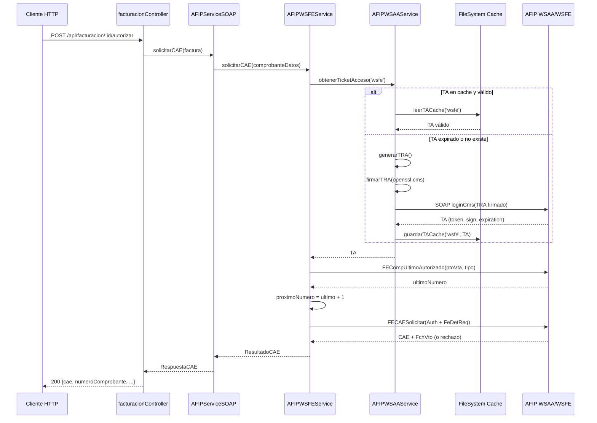

# Sistema SOAP AFIP - Arquitectura y Documentación Técnica

## 📚 Índice

1. [Visión General](#visión-general)
2. [Arquitectura](#arquitectura)
3. [Servicios SOAP](#servicios-soap)
4. [Flujos de Datos](#flujos-de-datos)
5. [Manejo de Errores](#manejo-de-errores)
6. [Seguridad](#seguridad)
7. [Performance y Caching](#performance-y-caching)
8. [Testing](#testing)
9. [Deployment](#deployment)
10. [Troubleshooting](#troubleshooting)

---

## 🎯 Visión General

Sistema de integración con AFIP (Administración Federal de Ingresos Públicos) para facturación electrónica, implementado con **SOAP nativo** sin dependencias de SDKs comerciales.

### ¿Por qué SOAP Nativo?

| Aspecto | SDK Comercial (@afipsdk/afip.js) | SOAP Nativo |
|---------|----------------------------------|-------------|
| **Costo** | Requiere SDK_ACCESS_TOKEN pago | ✅ Gratis |
| **Transparencia** | Código cerrado (black box) | ✅ 100% auditable |
| **Control** | Limitado a funciones del SDK | ✅ Total |
| **Debugging** | Difícil (errores genéricos) | ✅ Logs detallados |
| **Mantenimiento** | Depende del vendor | ✅ Independiente |
| **Producción** | Requiere plan pago | ✅ Sin límites |

### Servicios AFIP Utilizados

- **WSAA** (Web Service de Autenticación y Autorización): Login y obtención de Tickets de Acceso
- **WSFE** (Web Service de Facturación Electrónica): Autorización de comprobantes, consultas

---

## 🏗️ Arquitectura

### Diagrama de Capas

```
┌───────────────────────────────────────────────────────────┐
│                   HTTP Layer                              │
│  facturacionController.ts (Express Routes)                │
│  - POST /api/facturacion/desde-venta                      │
│  - POST /api/facturacion/:id/autorizar                    │
│  - GET  /api/facturacion/:id/verificar-cae                │
└─────────────────────┬─────────────────────────────────────┘
                      │
                      ↓
┌───────────────────────────────────────────────────────────┐
│                  Service Layer (Facade)                   │
│  AFIPServiceSOAP.ts                                       │
│  - solicitarCAE(factura)                                  │
│  - obtenerUltimoNumeroComprobante()                       │
│  - verificarCAE()                                         │
│  - obtenerPuntosVenta()                                   │
└───────────┬───────────────────────────┬───────────────────┘
            │                           │
            ↓                           ↓
┌───────────────────────┐   ┌───────────────────────────────┐
│  AFIPWSAAService      │   │  AFIPWSFEService              │
│  (Autenticación)      │   │  (Facturación)                │
│                       │   │                               │
│  - obtenerTicketAcceso│   │  - solicitarCAE               │
│  - generarTRA         │   │  - obtenerUltimoComprobante   │
│  - firmarTRA          │   │  - consultarComprobante       │
│  - leerTACache        │   │  - obtenerPuntosVenta         │
│  - guardarTACache     │   │  - consultarEstadoServidor    │
└───────────┬───────────┘   └───────────┬───────────────────┘
            │                           │
            └───────────┬───────────────┘
                        │
                        ↓
            ┌───────────────────────┐
            │  Infrastructure       │
            │                       │
            │  - OpenSSL (firma)    │
            │  - axios (HTTP)       │
            │  - xml2js (parsing)   │
            │  - fs (cache)         │
            └───────────┬───────────┘
                        │
                        ↓
            ┌───────────────────────┐
            │   AFIP Web Services   │
            │                       │
            │  WSAA: Autenticación  │
            │  WSFE: Facturación    │
            └───────────────────────┘
```

### Principios de Diseño

1. **Separation of Concerns**: Cada capa tiene responsabilidad única
2. **Dependency Injection**: Configuración externa, testeable
3. **Single Responsibility**: Cada servicio hace una cosa bien
4. **Interface Segregation**: APIs pequeñas y específicas
5. **Liskov Substitution**: AFIPServiceSOAP es drop-in replacement del SDK

---

## 🔌 Servicios SOAP

### 1. AFIPWSAAService - Autenticación

**Propósito**: Obtener Ticket de Acceso (TA) para autorizar operaciones en WSFE.

#### Flujo de Autenticación

```
1. Verificar cache de TA
   ↓ (si expiró o no existe)
2. Generar TRA (XML)
   - uniqueId (timestamp)
   - generationTime (Argentina TZ)
   - expirationTime (+24h)
   - service (wsfe)
   - destination (DN del WSAA)
   ↓
3. Firmar TRA con OpenSSL
   - Algoritmo: CMS/PKCS#7
   - Formato: DER (binary)
   - Certificado: cert.crt
   - Clave privada: private.key
   ↓
4. Enviar SOAP a WSAA
   - Endpoint: wsaahomo.afip.gov.ar (testing)
   - Método: loginCms
   - Body: TRA firmado (base64)
   ↓
5. Parsear respuesta
   - Extraer token, sign, expirationTime
   ↓
6. Cachear TA
   - Archivo: afip_tokens/TA-wsfe.json
   - TTL: 12 horas (11h para safety margin)
   ↓
7. Retornar TA
```

#### API Pública

```typescript
class AFIPWSAAService {
  constructor(config: WSAAConfig)
  
  // Obtiene TA válido (desde cache o nuevo)
  async obtenerTicketAcceso(servicio: string = 'wsfe'): Promise<TicketAcceso>
  
  // Limpia cache (útil para debugging)
  limpiarCache(servicio?: string): void
}
```

#### Ejemplo de Uso

```typescript
const wsaaService = new AFIPWSAAService({
  cuit: '27118154520',
  certPath: './certs/cert.crt',
  keyPath: './certs/private.key',
  production: false,
  taFolder: './afip_tokens'
});

const ta = await wsaaService.obtenerTicketAcceso('wsfe');
// {
//   token: 'PD94bWwgdm...',
//   sign: 'l8YzKKq/Lx...',
//   generationTime: '2025-11-01T10:00:00-03:00',
//   expirationTime: '2025-11-01T22:00:00-03:00',
//   service: 'wsfe',
//   destination: 'cn=wsaahomo,o=afip,c=ar,serialNumber=CUIT...'
// }
```

#### Especificaciones Técnicas

- **Timezone**: AFIP requiere Argentina (UTC-3) en formato ISO 8601
- **Firma**: OpenSSL comando `cms -sign -nodetach -outform DER`
- **Cache**: JSON en filesystem, expira 1h antes del TA
- **Retry**: NO implementado (¿agregar?)
- **Timeout**: 30 segundos

---

### 2. AFIPWSFEService - Facturación

**Propósito**: Autorizar comprobantes, consultar CAEs, obtener datos de AFIP.

#### Operaciones Principales

##### A) Solicitar CAE (Autorización)

```typescript
async solicitarCAE(datos: ComprobanteDatos): Promise<ResultadoCAE>
```

**Flujo**:
```
1. Obtener TA de WSAA
   ↓
2. Consultar último número de comprobante
   - FECompUltimoAutorizado
   - puntoVenta + tipoComprobante
   ↓
3. Incrementar número (último + 1)
   ↓
4. Construir SOAP FECAESolicitar
   - FeCabReq: PtoVta, CbteTipo, CantReg
   - FeDetReq: Concepto, DocTipo, DocNro, Importes, IVA, etc
   ↓
5. Enviar a WSFE
   - Auth: Token, Sign, CUIT
   - Timeout: 30s
   ↓
6. Parsear respuesta
   - Resultado: A (aprobado) / R (rechazado)
   - CAE: 14 dígitos
   - FchVto: fecha vencimiento CAE
   - Obs: observaciones/errores
   ↓
7. Retornar resultado
```

**Ejemplo**:

```typescript
const wsfeService = new AFIPWSFEService(config);

const resultado = await wsfeService.solicitarCAE({
  puntoVenta: 2,
  tipoComprobante: 6, // Factura B
  concepto: 1, // Productos
  tipoDocumento: 96, // DNI
  numeroDocumento: '12345678',
  fecha: new Date(),
  importeTotal: 121.00,
  importeNeto: 100.00,
  importeIVA: 21.00,
  importeNoGravado: 0,
  importeExento: 0,
  importeTributos: 0,
  monedaId: 'PES',
  monedaCotizacion: 1,
  iva: [{
    id: 5, // IVA 21%
    baseImponible: 100.00,
    importe: 21.00
  }]
});

if (resultado.resultado === 'A') {
  console.log('CAE:', resultado.cae);
  console.log('Vencimiento:', resultado.fechaVencimientoCAE);
} else {
  console.log('Rechazado:', resultado.errores);
}
```

##### B) Obtener Último Comprobante

```typescript
async obtenerUltimoComprobante(puntoVenta: number, tipoComprobante: number): Promise<number>
```

**Uso**: Antes de autorizar, para saber próximo número.

##### C) Consultar Comprobante

```typescript
async consultarComprobante(puntoVenta, tipoComprobante, numeroComprobante): Promise<any>
```

**Uso**: Verificar CAE existente, validar con AFIP.

##### D) Obtener Puntos de Venta

```typescript
async obtenerPuntosVenta(): Promise<Array<{numero: number, bloqueado: boolean}>>
```

**Uso**: Listar puntos de venta habilitados en AFIP.

##### E) Consultar Estado Servidor

```typescript
async consultarEstadoServidor(): Promise<{appServer, dbServer, authServer}>
```

**Uso**: Health check de AFIP (similar a ping).

---

### 3. AFIPServiceSOAP - Facade Unificado

**Propósito**: API de alto nivel compatible con código existente (que usaba SDK).

#### API Simplificada

```typescript
class AFIPServiceSOAP {
  constructor(config: AFIPConfig)
  
  // Autorizar factura (principal)
  async solicitarCAE(factura: DatosFactura): Promise<RespuestaCAE>
  
  // Consultas
  async obtenerUltimoNumeroComprobante(tipo: string, ptoVta?: number): Promise<number>
  async verificarCAE(ptoVta, tipo, numero): Promise<any>
  async obtenerPuntosVenta(): Promise<Array<{...}>>
  
  // Utilidades estáticas
  static determinarTipoFactura(empresaIVA, clienteIVA, tipo): string
  static calcularIVA(neto, alicuota): number
  static generarCodigoBarras(cuit, tipo, ptoVta, cae, fechaVto): string
  static validarFactura(factura): {valido, errores}
}
```

#### Diferencias con SDK Comercial

| Método SDK | Método SOAP | Cambios |
|------------|-------------|---------|
| `createVoucher()` | `solicitarCAE()` | ✅ Igual comportamiento |
| `getLastVoucher()` | `obtenerUltimoNumeroComprobante()` | ✅ Nombre más descriptivo |
| `getVoucherInfo()` | `verificarCAE()` | ✅ Mismo resultado |
| `getSalesPoints()` | `obtenerPuntosVenta()` | ✅ Traducido a español |

**Migración**: Cambiar import y nombres de métodos, el resto del código sigue igual.

---

## 🔄 Flujos de Datos

### Flujo Completo: Autorizar Factura



### Flujo de Renovación de TA

```
Tiempo 0h: Cliente crea factura
   ↓
   TA se obtiene y cachea (válido 12h)
   ↓
Tiempo 6h: Otra factura
   ↓
   TA leído de cache (aún válido)
   ↓
Tiempo 11h: Otra factura
   ↓
   TA tiene <1h restante
   ↓
   Sistema regenera TA automáticamente
   ↓
   Nuevo TA válido por 12h más
   ↓
Tiempo 13h: Otra factura
   ↓
   Usa nuevo TA
```

**Safety Margin**: Sistema renueva TA 1 hora ANTES de expiración para evitar race conditions.

---

## ⚠️ Manejo de Errores

### Categorías de Errores

#### 1. Errores de Configuración (startup)

```typescript
// Certificado no encontrado
Error: ENOENT: no such file or directory, open './certs/cert.crt'
→ Verificar AFIP_CERT_PATH en .env

// Clave privada inválida
Error: unable to load private key
→ Verificar formato del archivo private.key
```

#### 2. Errores de Autenticación WSAA

```typescript
// Certificado no autorizado
SOAP Fault: coe.notAuthorized
→ Autorizar certificado para servicio 'wsfe' en AFIP

// TRA expirado (>24h)
SOAP Fault: xml.generationTime.invalid
→ Verificar reloj del servidor (NTP sync)

// Firma inválida
SOAP Fault: cms.sign.invalid
→ Verificar OpenSSL instalado y comando 'cms' disponible
```

#### 3. Errores de Facturación WSFE

```typescript
// CUIT no válido
Resultado: 'R', Errores: ["[10016] El CUIT informado no existe"]
→ Verificar CUIT del cliente en AFIP

// Punto de venta no habilitado
Errores: ["[10015] Punto de venta no habilitado"]
→ Crear punto de venta en AFIP web

// Comprobante duplicado
Errores: ["[10017] Número de comprobante ya informado"]
→ AFIP ya tiene ese número, usar siguiente
```

#### 4. Errores de Red

```typescript
// Timeout
Error: timeout of 30000ms exceeded
→ AFIP no respondió, reintentar

// Connection refused
Error: connect ECONNREFUSED
→ AFIP fuera de servicio, verificar status
```

### Estrategia de Retry

**Actual**: NO implementado  
**Recomendado**: 
```typescript
// Exponential backoff
intentos = 0;
while (intentos < 3) {
  try {
    return await wsfe.solicitarCAE(datos);
  } catch (error) {
    if (error.isRetryable) {
      intentos++;
      await sleep(2 ** intentos * 1000); // 2s, 4s, 8s
    } else {
      throw error;
    }
  }
}
```

### Logging de Errores

Todos los servicios usan console con emojis para visibilidad:

```
❌ Error al firmar TRA: Command failed: openssl cms...
⚠️  TA expiró, regenerando...
✅ CAE autorizado exitosamente
```

**Producción**: Reemplazar `console` con logger estructurado (Winston, Pino).

---

## 🔐 Seguridad

### Archivos Sensibles

```bash
# NUNCA commitear
backend/certs/private.key       # Clave privada
backend/certs/cert.crt          # Certificado (contiene CUIT)
backend/.env                    # Configuración
backend/afip_tokens/*.json      # TAs (contienen tokens)
```

### .gitignore

```gitignore
# AFIP Sensitive
/backend/certs/
/backend/afip_tokens/
/backend/.env
```

### Permisos de Archivos

```bash
# Clave privada: solo lectura para owner
chmod 600 backend/certs/private.key

# Certificado: lectura para owner/group
chmod 640 backend/certs/cert.crt

# TA folder: owner puede escribir
chmod 750 backend/afip_tokens/
```

### Renovación de Certificados

**Vigencia**: 2 años (renovar 1 mes antes de expiración)

**Proceso**:
1. Generar nuevo CSR (mismo procedimiento inicial)
2. Subir a AFIP → Renovar Certificado
3. Descargar nuevo cert.crt
4. Reemplazar archivo (NO tocar private.key)
5. Reiniciar servicio
6. Verificar: `npm run afip:obtener-ta`

### Ambientes Separados

```bash
# Homologación
AFIP_PRODUCTION=false
AFIP_CERT_PATH=./certs/cert-homo.crt
AFIP_KEY_PATH=./certs/private-homo.key

# Producción
AFIP_PRODUCTION=true
AFIP_CERT_PATH=./certs/cert-prod.crt
AFIP_KEY_PATH=./certs/private-prod.key
```

**IMPORTANTE**: Usar certificados DIFERENTES para cada ambiente.

---

## ⚡ Performance y Caching

### Métricas Esperadas

| Operación | Latencia (p50) | Latencia (p99) |
|-----------|----------------|----------------|
| obtenerTicketAcceso (cached) | ~5ms | ~20ms |
| obtenerTicketAcceso (nuevo) | ~1.5s | ~3s |
| solicitarCAE | ~2s | ~5s |
| obtenerUltimoComprobante | ~800ms | ~2s |
| consultarComprobante | ~1s | ~3s |

### Estrategia de Caching

#### TA Cache (AFIPWSAAService)

- **Almacenamiento**: Filesystem JSON
- **Ubicación**: `afip_tokens/TA-{servicio}.json`
- **TTL**: 12 horas (AFIP), 11 horas (safety margin)
- **Invalidación**: Por tiempo o manual (`limpiarCache()`)
- **Concurrencia**: NO thread-safe (usar locks en cluster)

**Estructura del cache**:
```json
{
  "token": "PD94bWwgdmVyc2lvbj0iMS4wIiBlbmNvZGluZz0iVVRGLTgiPz4...",
  "sign": "l8YzKKq/LxuiQ7U2Z8RqVvMsI5Dv8jW9XnP0mKoLbNaCdEfGhIjK...",
  "generationTime": "2025-11-01T10:00:00-03:00",
  "expirationTime": "2025-11-01T22:00:00-03:00",
  "service": "wsfe",
  "destination": "cn=wsaahomo,o=afip,c=ar,serialNumber=CUIT..."
}
```

#### Optimizaciones Futuras

**Redis Cache**:
```typescript
// En lugar de filesystem
class RedisCacheAdapter {
  async get(key: string): Promise<TicketAcceso | null>
  async set(key: string, value: TicketAcceso, ttl: number): Promise<void>
}
```

**Connection Pooling**:
```typescript
// Reutilizar conexiones HTTP
const agent = new https.Agent({ keepAlive: true, maxSockets: 10 });
axios.defaults.httpAgent = agent;
```

---

## 🧪 Testing

### Scripts Disponibles

```bash
# 1. Test autenticación WSAA
npm run afip:obtener-ta

# 2. Test sistema completo (WSAA + WSFE)
npm run afip:test-soap

# 3. Test conexión básica
npm run afip:test-conexion
```

### Estructura de Tests (a implementar)

```
backend/tests/
├── unit/
│   ├── AFIPWSAAService.test.ts
│   ├── AFIPWSFEService.test.ts
│   └── AFIPServiceSOAP.test.ts
├── integration/
│   ├── autenticacion.test.ts
│   └── facturacion.test.ts
└── e2e/
    └── flujo-completo.test.ts
```

### Ejemplo de Test Unitario

```typescript
import { AFIPWSAAService } from '../src/services/afip';

describe('AFIPWSAAService', () => {
  it('debe generar TRA con formato correcto', () => {
    const service = new AFIPWSAAService(config);
    const tra = service['generarTRA']('wsfe'); // private method
    
    expect(tra).toContain('<uniqueId>');
    expect(tra).toContain('<service>wsfe</service>');
    expect(tra).toContain('-03:00'); // Argentina TZ
  });
  
  it('debe cachear TA correctamente', async () => {
    const service = new AFIPWSAAService(config);
    
    const ta1 = await service.obtenerTicketAcceso('wsfe');
    const ta2 = await service.obtenerTicketAcceso('wsfe');
    
    expect(ta1.token).toBe(ta2.token); // Mismo TA desde cache
  });
});
```

---

## 🚀 Deployment

### Checklist Pre-Deploy

- [ ] Variables de entorno configuradas (`.env`)
- [ ] Certificados válidos y autorizados en AFIP
- [ ] OpenSSL instalado en servidor
- [ ] `afip_tokens/` folder con permisos de escritura
- [ ] Tests pasando (`npm run afip:test-soap`)
- [ ] Ambiente correcto (`AFIP_PRODUCTION=true/false`)
- [ ] Logs configurados (Winston/CloudWatch)
- [ ] Monitoring (health checks, alerts)

### Variables de Entorno Requeridas

```bash
# AFIP Auth
AFIP_CUIT=30714836036
AFIP_PRODUCTION=true
AFIP_CERT_PATH=/app/certs/cert.crt
AFIP_KEY_PATH=/app/certs/private.key
AFIP_TA_FOLDER=/app/afip_tokens
AFIP_PUNTO_VENTA=2

# Company
EMPRESA_CUIT=30714836036
EMPRESA_RAZON_SOCIAL=Kurt Argentina
```

### Docker

```dockerfile
FROM node:18-alpine

# Instalar OpenSSL
RUN apk add --no-cache openssl

WORKDIR /app

# Copiar dependencias
COPY package*.json ./
RUN npm ci --only=production

# Copiar código
COPY dist/ ./dist/
COPY scripts/ ./scripts/

# Crear folders para AFIP
RUN mkdir -p /app/afip_tokens /app/certs
RUN chown -R node:node /app

USER node

CMD ["node", "dist/server.js"]
```

### Health Check

```typescript
// backend/src/routes/health.ts
router.get('/afip-status', async (req, res) => {
  try {
    const afip = new AFIPServiceSOAP(getConfig());
    const estado = await afip.consultarEstadoServidor();
    
    res.json({
      status: 'ok',
      afip: estado,
      timestamp: new Date()
    });
  } catch (error) {
    res.status(500).json({
      status: 'error',
      message: error.message
    });
  }
});
```

---

## 🔧 Troubleshooting

### Problema: "OpenSSL no encontrado"

**Síntomas**: 
```
Error: Command failed: openssl cms -sign...
/bin/sh: openssl: command not found
```

**Solución**:
```bash
# Windows
choco install openssl

# Ubuntu/Debian
sudo apt-get install openssl

# Mac
brew install openssl
```

### Problema: "Certificado no autorizado"

**Síntomas**:
```
SOAP Fault: coe.notAuthorized
```

**Diagnóstico**:
```bash
# Ver servicios autorizados
openssl x509 -in cert.crt -noout -text | grep "wsfe"
```

**Solución**:
1. Ir a AFIP → Administrador de Relaciones
2. Certificados Digitales
3. Seleccionar certificado
4. Autorizar servicio "wsfe"
5. Esperar 5 minutos (propagación)
6. Retry: `npm run afip:obtener-ta`

### Problema: "Fecha inválida en TRA"

**Síntomas**:
```
SOAP Fault: xml.generationTime.invalid
```

**Causa**: Reloj del servidor desincronizado

**Solución**:
```bash
# Sincronizar con NTP
sudo ntpdate -s time.nist.gov

# Verificar timezone
timedatectl
# Debe mostrar: Time zone: America/Argentina/Buenos_Aires
```

### Problema: "CAE duplicado"

**Síntomas**:
```
Errores: ["[10017] Número de comprobante ya informado"]
```

**Causa**: Se intentó autorizar mismo número dos veces

**Solución**:
1. Consultar último número: `obtenerUltimoComprobante()`
2. Usar siguiente número
3. Si persiste: revisar lógica de incremento en código

### Debugging Avanzado

**Ver XML SOAP enviado/recibido**:

```typescript
// En AFIPWSFEService.ts, método enviarSOAP()
console.log('📤 SOAP Request:', soapMessage);
console.log('📥 SOAP Response:', response.data);
```

**Logs de OpenSSL**:

```typescript
// En AFIPWSAAService.ts, método firmarTRA()
execSync(`openssl cms ... > /tmp/firma.log 2>&1`);
console.log(fs.readFileSync('/tmp/firma.log', 'utf8'));
```

---

## 📞 Soporte

### Enlaces AFIP

- [Portal AFIP](https://www.afip.gob.ar)
- [Documentación WSFE](https://www.afip.gob.ar/fe/documentos/manual_desarrollador_COMPG_v2_10.pdf)
- [Consultar CAE](https://www.afip.gob.ar/fe/ayuda/consulta_cae.asp)
- [Status Servicios](https://estadoservicios.afip.gob.ar/)

### Contacto Interno

- **Maintainer**: Sistema myGestor
- **Email**: [agregar email]
- **Docs**: `backend/FACTURACION_AFIP.md`
- **Changelog**: Git history en `/backend/src/services/afip/`

---

**Última actualización**: Noviembre 2025  
**Versión**: 2.0.0 (SOAP Nativo)
