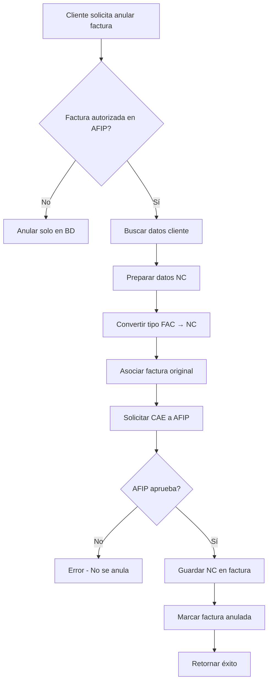

# Implementación de Notas de Crédito AFIP

## 📋 Descripción

En AFIP, **no se anulan facturas directamente**. Para anular o rectificar una factura autorizada, se debe emitir una **Nota de Crédito** que referencia la factura original.

Esta implementación permite:
- ✅ Emitir Notas de Crédito automáticas al anular facturas
- ✅ Emitir Notas de Crédito parciales (para correcciones)
- ✅ Emitir Notas de Débito (para agregar importes)
- ✅ Validación automática con AFIP
- ✅ Construcción de XML SOAP siguiendo el patrón implementado

---

## 🏗️ Arquitectura Implementada

### 1. Servicios AFIP (Capa SOAP)

#### `AFIPWSFEService.ts`
```typescript
/**
 * Emite una Nota de Crédito para anular/rectificar una factura
 */
async emitirNotaCredito(datosNotaCredito: ComprobanteDatos): Promise<ResultadoCAE>

/**
 * Emite una Nota de Débito
 */
async emitirNotaDebito(datosNotaDebito: ComprobanteDatos): Promise<ResultadoCAE>
```

**Validaciones:**
- ✅ Debe tener comprobantes asociados
- ✅ Tipo de comprobante debe ser NC (3, 8, 13) o ND (2, 7, 12)
- ✅ Construye XML SOAP con el mismo patrón que `FECAESolicitar`

#### `AFIPServiceSOAP.ts` (Facade)
```typescript
/**
 * Emite NC automática basada en factura original
 */
async emitirNotaCredito(
  facturaOriginal: DatosFactura,
  motivo?: string
): Promise<RespuestaCAE>

/**
 * Emite ND para agregar importes
 */
async emitirNotaDebito(
  facturaOriginal: DatosFactura,
  nuevoImporte: number,
  motivo?: string
): Promise<RespuestaCAE>
```

**Funcionalidad:**
- 🔄 Convierte tipo de factura a NC/ND automáticamente (A→NC_A, B→NC_B, C→NC_C)
- 📋 Mantiene importes de factura original (para anulación total)
- 🔗 Asocia automáticamente la factura original

---

### 2. Controlador de Facturación

#### `anularFactura` (Actualizado)
```typescript
POST /api/facturacion/:id/anular
Body: {
  "motivo": "Razón de la anulación",
  "emitirNC": true  // opcional, por defecto true
}
```

**Flujo:**
1. ✅ Valida que la factura exista y no esté anulada
2. ✅ Si está autorizada en AFIP (`estado: 'autorizada'` y tiene CAE):
   - Busca el cliente
   - Prepara datos de NC con importes de factura original
   - Emite NC en AFIP
   - Si AFIP aprueba → guarda referencia en factura
   - Si AFIP rechaza → retorna error sin anular
3. ✅ Marca factura como anulada en BD
4. ✅ Retorna factura anulada + datos de NC

**Respuesta exitosa:**
```json
{
  "message": "Factura anulada exitosamente",
  "factura": { /* factura con estado 'anulada' */ },
  "notaCredito": {
    "cae": "72345678901234",
    "numeroComprobante": 123,
    "fechaVencimientoCAE": "2025-12-05",
    "observaciones": ["Nota..."]
  }
}
```

#### `emitirNotaCredito` (Nuevo)
```typescript
POST /api/facturacion/:id/nota-credito
Body: {
  "motivo": "Razón de la NC",
  "importeParcial": 500.00  // opcional, si no se envía es total
}
```

**Casos de uso:**
- 📄 **NC Total**: No enviar `importeParcial` → anula factura completa
- 📄 **NC Parcial**: Enviar `importeParcial` → descuento/corrección parcial

**Cálculos proporcionales para NC parcial:**
```typescript
const proporcion = importeNC / factura.importeTotal;

importes = {
  neto: factura.importeNetoGravado * proporcion,
  iva: factura.importeIVA * proporcion,
  // ... todos los importes se multiplican por proporción
}
```

---

## 🔧 Construcción de XML SOAP

### Estructura de NC/ND (igual que Factura)

```xml
<ar:FECAESolicitar>
  <ar:Auth>
    <ar:Token>...</ar:Token>
    <ar:Sign>...</ar:Sign>
    <ar:Cuit>...</ar:Cuit>
  </ar:Auth>
  <ar:FeCAEReq>
    <ar:FeCabReq>
      <ar:CantReg>1</ar:CantReg>
      <ar:PtoVta>1</ar:PtoVta>
      <ar:CbteTipo>3</ar:CbteTipo> <!-- 3=NC_A, 8=NC_B, 13=NC_C -->
    </ar:FeCabReq>
    <ar:FeDetReq>
      <ar:FECAEDetRequest>
        <!-- Datos del comprobante -->
        <ar:Concepto>1</ar:Concepto>
        <ar:DocTipo>80</ar:DocTipo>
        <ar:DocNro>20123456789</ar:DocNro>
        <ar:CbteDesde>123</ar:CbteDesde>
        <ar:CbteHasta>123</ar:CbteHasta>
        <ar:CbteFch>20251125</ar:CbteFch>
        
        <!-- Importes (negativos o iguales a factura original) -->
        <ar:ImpTotal>10500.00</ar:ImpTotal>
        <ar:ImpNeto>8677.69</ar:ImpNeto>
        <ar:ImpIVA>1822.31</ar:ImpIVA>
        <!-- ... otros importes -->
        
        <ar:CondicionIVAReceptorId>1</ar:CondicionIVAReceptorId>
        
        <!-- IVA detallado -->
        <ar:Iva>
          <ar:AlicIva>
            <ar:Id>5</ar:Id> <!-- 21% -->
            <ar:BaseImp>8677.69</ar:BaseImp>
            <ar:Importe>1822.31</ar:Importe>
          </ar:AlicIva>
        </ar:Iva>
        
        <!-- IMPORTANTE: Comprobantes asociados -->
        <ar:CbtesAsoc>
          <ar:CbteAsoc>
            <ar:Tipo>1</ar:Tipo> <!-- Tipo factura original -->
            <ar:PtoVta>1</ar:PtoVta>
            <ar:Nro>100</ar:Nro> <!-- Número factura original -->
          </ar:CbteAsoc>
        </ar:CbtesAsoc>
      </ar:FECAEDetRequest>
    </ar:FeDetReq>
  </ar:FeCAEReq>
</ar:FECAESolicitar>
```

**Claves importantes:**
- `<ar:CbteTipo>`: 3=NC_A, 8=NC_B, 13=NC_C
- `<ar:CbtesAsoc>`: **OBLIGATORIO** - debe referenciar factura original
- Importes: mismos que factura original (para anulación total)

---

## 📖 Documentación AFIP

### Tipos de Comprobante
```typescript
TIPO_COMPROBANTE = {
  FACTURA_A: 1,
  FACTURA_B: 6,
  FACTURA_C: 11,
  NOTA_DEBITO_A: 2,
  NOTA_DEBITO_B: 7,
  NOTA_DEBITO_C: 12,
  NOTA_CREDITO_A: 3,    // ← Para anular Factura A
  NOTA_CREDITO_B: 8,    // ← Para anular Factura B
  NOTA_CREDITO_C: 13    // ← Para anular Factura C
}
```

### Reglas de Negocio AFIP

1. **Comprobantes Asociados**: Obligatorio para NC/ND
2. **Tipo coherente**: NC_A solo puede anular Factura_A, etc.
3. **Importes**: Pueden ser iguales o menores (parcial)
4. **Fecha**: NC siempre tiene fecha actual (no puede ser anterior)
5. **CAE independiente**: NC obtiene su propio CAE

---

## 🧪 Testing

### 1. Anular factura completa
```bash
curl -X POST "http://localhost:3001/api/facturacion/673f1234567890abcdef/anular" \
  -H "Authorization: Bearer <TOKEN>" \
  -H "Content-Type: application/json" \
  -d '{
    "motivo": "Error en datos del cliente"
  }'
```

### 2. Emitir NC parcial
```bash
curl -X POST "http://localhost:3001/api/facturacion/673f1234567890abcdef/nota-credito" \
  -H "Authorization: Bearer <TOKEN>" \
  -H "Content-Type: application/json" \
  -d '{
    "motivo": "Descuento por promoción",
    "importeParcial": 500.00
  }'
```

### 3. Verificar en AFIP
```bash
# El CAE de la NC se puede verificar igual que una factura
curl "http://localhost:3001/api/facturacion/<ID_NC>/verificar-cae" \
  -H "Authorization: Bearer <TOKEN>"
```

---

## 📊 Logs de Debug

### Emisión exitosa
```
📋 ========== EMISIÓN NOTA DE CRÉDITO ==========
📋 Tipo comprobante: 3
📋 Comprobantes asociados: [{ tipo: 1, puntoVenta: 1, numero: 100 }]
📊 Próximo número de NC: 51
📝 FeDetRequest construido para NC

🌐 Enviando solicitud de NC a AFIP...
✅ Respuesta recibida de AFIP
🎯 Resultado NC: ✅ APROBADA
========== FIN EMISIÓN NOTA DE CRÉDITO ==========
```

### Rechazo AFIP
```
❌ ========== ERROR EN EMISIÓN NC ==========
❌ Error: AFIP rechazó la Nota de Crédito
   Errores:
   - [10016] El número de comprobante asociado no existe
========== FIN ERROR ==========
```

---

## 🔄 Flujo Completo



---

## ⚠️ Consideraciones Importantes

### 1. **No se puede anular una NC**
Una vez emitida una NC, no se puede anular. Si se emitió por error, se debe emitir una Nota de Débito (ND) para revertirla.

### 2. **Importes en NC**
- **Total**: Importes iguales a factura original
- **Parcial**: Importes proporcionales (respetando relación IVA)

### 3. **Estados de factura**
```
borrador → autorizada → anulada (con NC en AFIP)
                    ↓
                 rechazada (sin NC)
```

### 4. **Referencia a factura original**
```typescript
comprobantesAsociados: [{
  tipo: 1,              // Tipo factura original (1=FAC_A)
  puntoVenta: 1,
  numero: 100          // Número secuencial, NO el completo "00001-00000100"
}]
```

---

## 🚀 Mejoras Futuras

1. **Modelo de NC independiente**: Crear colección `NotasCredito` en BD
2. **Historial de NC**: Relacionar facturas con sus NC emitidas
3. **PDF de NC**: Generar comprobante imprimible
4. **Validación previa**: Verificar que factura original exista en AFIP antes de emitir NC
5. **NC por diferencia de precio**: Automatizar cálculo de NC parciales

---

## 📚 Referencias

- [Manual WSFE - AFIP](http://www.afip.gob.ar/ws/documentacion/ws-factura-electronica.asp)
- [Tipos de Comprobante](https://www.afip.gob.ar/ws/documentacion/ws-factura-electronica.asp#tipos)
- Documentación interna: `AFIP_SOAP_ARCHITECTURE.md`

---

## ✅ Checklist de Implementación

- [x] Método `emitirNotaCredito` en `AFIPWSFEService`
- [x] Método `emitirNotaDebito` en `AFIPWSFEService`
- [x] Facade `emitirNotaCredito` en `AFIPServiceSOAP`
- [x] Facade `emitirNotaDebito` en `AFIPServiceSOAP`
- [x] Actualizar `anularFactura` para emitir NC automática
- [x] Endpoint `POST /:id/nota-credito` para NC manual
- [x] Validaciones de tipos (ComprobanteDatos)
- [x] Construcción XML SOAP con `<CbtesAsoc>`
- [x] Logs de debug detallados
- [x] Documentación completa

---

**Autor**: Sistema myGestor  
**Fecha**: 25 de noviembre de 2025  
**Versión**: 1.0.0
